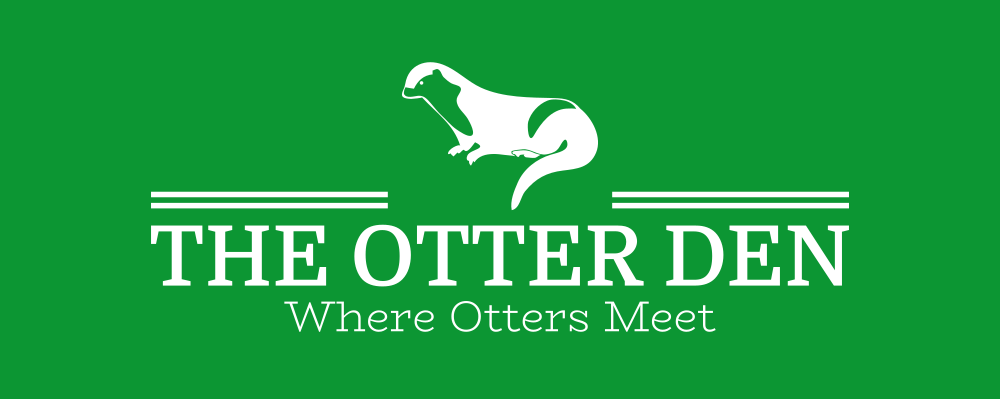

# Welcome to The Otter Den!

The Otter Den is a small and very simple flask-based online blog. Its purpose is *not* to be publicly deployed but
to serve as a pet project to learn how various aspects of software development and programming work. 
Further, The Otter Den will henceforth be referenced as OtterDen as this is less effort to type and it is a name
used within the code aswell.

A little bit about its history first: I started this project at the end of 2021 and began in earnest in early 2022
using a series of tutorials by [Corey Schafer](https://www.youtube.com/@coreyms) I found on YouTube. 
While I used his great guide as a base my plan is to gradually build on top of it and experiment with different ideas
and to really flesh out what OtterDen is.

Features I have added since finishing the tutorial course include:

- Ability to upload images to posts (wip)
- Ability to switch between dark and light mode
- Dedicated profile page for individual users
- Post history page to see all posts of a user
- Set up selenium and behave testsuite to automate future testing

All of this is still heavily WIP and I will update this list if I have time.

## Contributing

If you read this I assume I made this repository public. If you would like to help build OtterDen
please check the [Issues](https://github.com/ByteOtter/OtterDen/issues) section where I have a list of bugs and future features. 
Feel free to browse I am thankful for every contribution! :)

Please refer to the [Contributing Guide](./docs/CONTRIBUTING.md) if you need any help.

## Security notice

Please note that OtterDen **is not intended to be deployed in any capacity**. It is a learning project that is best hosted by
the greatest hosting service ever: `localhost`.

Seriously, **security vulnarabilities are bound to be present**.

## Thank you for reading and, if you do, contributing! :)

- ByteOtter
